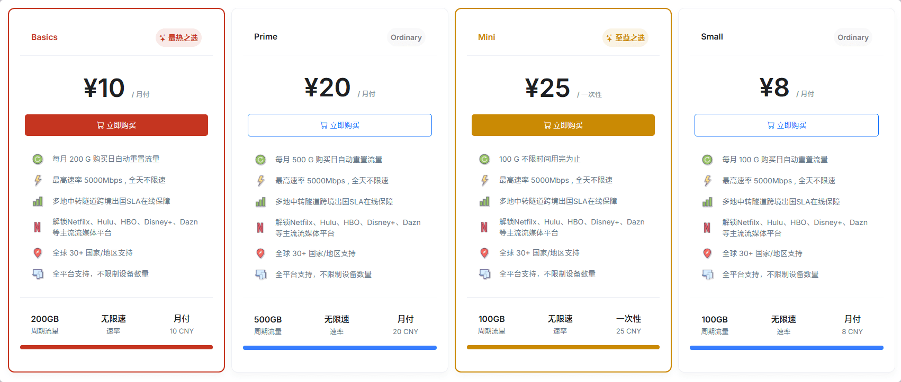

# EFCloud机场官网地址最新入口 + 优惠券

最新地址：[efcloud.bio](https://inv.easyfastcloud.com/#/register?code=WF4l8A7k)

## EFCloud介绍

EFCloud机场使用Trojan协议，全球30+国家/地区节点。多地中转隧道跨境出国SLA在线保障。超高带宽接入晚高峰速率保障4k秒开。支持 Chatgpt/Netfilx/Hulu/Hbo/Disney+ 等流媒体。

EFCloud机场最低套餐月付8元，支持支付宝/微信支付。

## EFCloud优惠码

圣诞、元旦8折优惠 限时活动 - 有效期至2025/1/10 23:59

全场8折优惠券：[2025](https://xuv.cc/out/efc)

******

新用户8折优惠 长期活动

全场8折优惠券: [new](https://xuv.cc/out/efc)

购买订阅时，填入优惠券并验证，即可享受优惠折扣。

## EFCloud价格

|套餐|Small|Basics|Prime|
|----|----|----|----|
|月付|￥8|￥10|￥20|
|季付|￥24|￥30|￥60|
|年付|￥80|￥100|￥200|

**一次性**

不限时套餐：Mini 总计100GB流量，¥25，用完为止。

